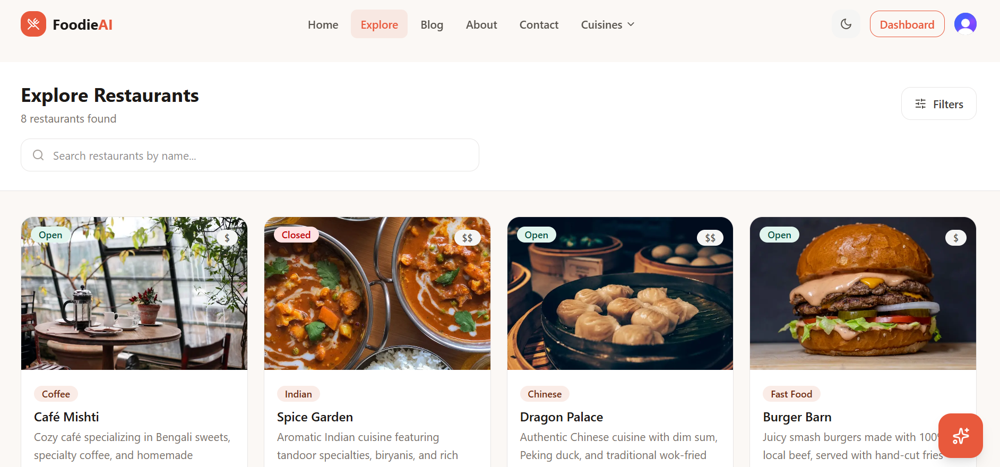
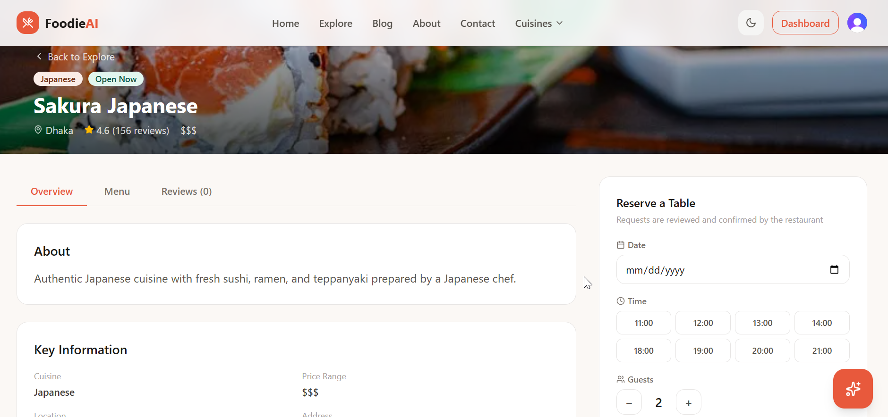
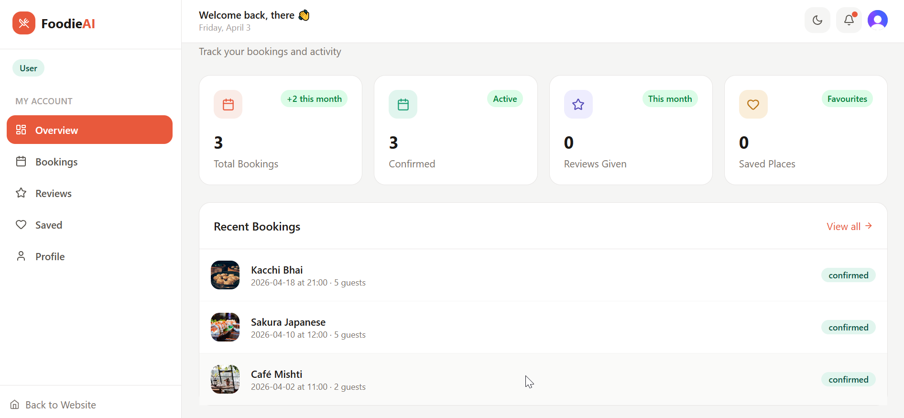
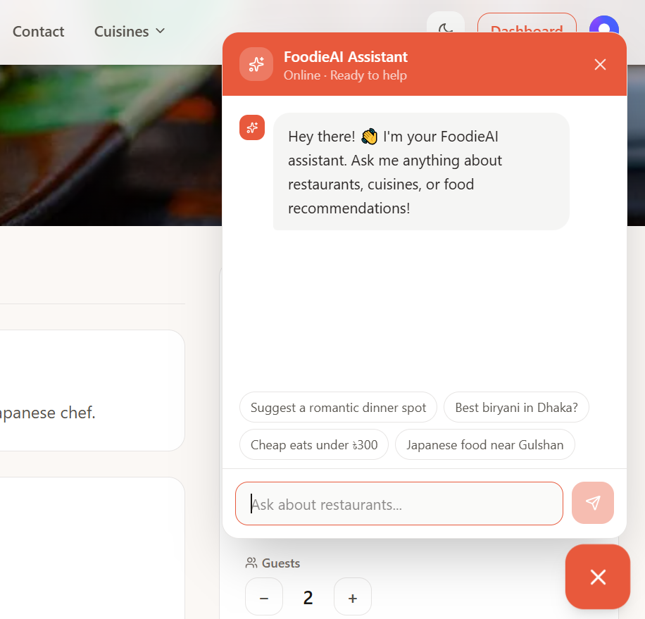

# 🍽️ FoodieAI — AI-Powered Restaurant Discovery Platform


> Discover the best restaurants near you. Powered by AI to give you personalized food recommendations, smart review summaries, and instant table bookings.

[](https://nextjs.org)
[](https://typescriptlang.org)
[](https://tailwindcss.com)
[](https://mongodb.com)
[](https://clerk.com)

---

## 🔗 Live Demo

**Live URL:** [https://foodie-ai-mu.vercel.app/](https://foodie-ai-mu.vercel.app/)

**GitHub:** [https://github.com/farial-robama/FoodieAI](https://github.com/farial-robama/FoodieAI)

---

## 🔐 Demo Credentials

| Role  | Email               | Password    |
|-------|---------------------|-------------|
| User  | user00@example.com    | User@123409  |
| Admin | farialrobama15@gmail.com   | 09876@fF  |

---

## ✨ Features

### 🌐 Public Features
- **Landing Page** — 10 sections: Hero, Categories, Featured, How It Works, Stats, Testimonials, Blog, Newsletter, CTA, Footer
- **Explore Page** — Search, filter by cuisine/price/rating/location, sort, paginate
- **Restaurant Detail** — Overview, menu, reviews, booking form, related restaurants
- **Blog** — Food articles and guides
- **About & Contact** — Team info, contact form

### 🤖 AI Features
- **AI Food Chatbot** — Floating widget on every page, answers food questions and recommends restaurants
- **AI Review Summarizer** — Summarizes all reviews for a restaurant into 3 key sentences
- **AI Description Generator** — Admin can auto-generate restaurant descriptions with one click

### 🔐 Authentication
- Email/password login and registration
- Google OAuth sign-in
- Email verification flow
- Demo login buttons (auto-fill credentials)
- Role-based access (User / Admin)

### 📊 Dashboard
**User Dashboard:**
- Overview with stats cards
- My Bookings (filter by status)
- My Reviews
- Saved Restaurants
- Profile management

**Admin Dashboard:**
- Analytics with Bar, Line, and Pie charts (real data)
- Manage Restaurants (search, paginate, delete, add)
- Manage Users (search, role badges)
- Manage Bookings (confirm / cancel actions)
- Settings page

### 🎨 UI/UX
- Light and Dark mode
- Fully responsive (Mobile, Tablet, Desktop)
- Skeleton loaders while data loads
- Smooth animations
- Clean consistent design system

---

## 🛠️ Tech Stack

### 🎨 Frontend
 
| Technology | Version | Purpose |
|------------|---------|---------|
| **Next.js** | 16.2.1 | React framework — App Router, SSR, SSG, API routes |
| **React** | 19 | UI component library |
| **TypeScript** | 5.0 | Static typing and type safety across entire codebase |
| **Tailwind CSS** | v4 | Utility-first CSS with custom `@theme` color variables |
| **Framer Motion** | latest | Page animations, hover effects, transitions |
| **Lucide React** | 0.460.0 | Consistent icon library (500+ icons) |
| **Recharts** | latest | Bar chart, Line chart, Pie chart for admin analytics |
| **React Hook Form** | latest | Form state management with minimal re-renders |
| **Zod** | latest | Schema-based form validation |
| **@hookform/resolvers** | latest | Bridge between Zod schemas and React Hook Form |
| **clsx** | latest | Conditional className utility |
| **tailwind-merge** | latest | Merge Tailwind classes without conflicts |
| **Geist Font** | built-in | Primary typography — Geist Sans + Geist Mono |
 
### ⚙️ Backend
 
| Technology | Version | Purpose |
|------------|---------|---------|
| **Next.js API Routes** | 16.2.1 | REST API with App Router route handlers |
| **MongoDB Atlas** | cloud | NoSQL cloud database with automatic scaling |
| **Mongoose** | latest | MongoDB ODM — schemas, models, validation, population |
| **Clerk** | latest | Auth — JWT sessions, Google OAuth, user management |
| **OpenRouter API** | — | Free AI inference — routes to Mistral 7B model |
| **Axios** | latest | HTTP client for server-side API calls |
| **dotenv** | latest | Environment variable loading for scripts |

---

## 📁 Project Structure

```
foodieai/
├── src/
│   ├── app/
│   │   ├── (root)/              # Public pages
│   │   │   ├── page.tsx         # Landing page
│   │   │   ├── explore/         # Browse restaurants
│   │   │   ├── restaurants/[id] # Detail page
│   │   │   ├── about/
│   │   │   ├── blog/
│   │   │   └── contact/
│   │   ├── (auth)/              # Auth pages
│   │   │   ├── login/
│   │   │   └── register/
│   │   ├── dashboard/           # Protected dashboard
│   │   │   ├── admin/           # Admin-only pages
│   │   │   ├── bookings/
│   │   │   ├── profile/
│   │   │   ├── reviews/
│   │   │   └── saved/
│   │   └── api/                 # API routes
│   │       ├── restaurants/
│   │       ├── bookings/
│   │       ├── reviews/
│   │       ├── users/
│   │       └── ai/
│   ├── components/
│   │   ├── ai/                  # ChatWidget
│   │   ├── dashboard/           # Sidebar, Charts, Tables
│   │   ├── layout/              # Navbar, Footer
│   │   ├── restaurant/          # Cards, Forms, Reviews
│   │   ├── sections/            # Landing page sections
│   │   └── ui/                  # Button, Input, Badge etc
│   ├── lib/                     # DB, utils, validations
│   ├── models/                  # Mongoose schemas
│   ├── hooks/                   # Custom React hooks
│   ├── types/                   # TypeScript interfaces
│   └── constants/               # App constants
└── scripts/
    └── seed.ts                  # Database seeder
```

---

## 🚀 Getting Started

### Prerequisites
- Node.js 18+
- MongoDB Atlas account (free)
- Clerk account (free)
- OpenRouter account (free)

### 1. Clone the repository
```bash
git clone https://github.com/farial-robama/Foodie_ai.git
cd foodieai
```

### 2. Install dependencies
```bash
npm install
```

### 3. Set up environment variables

Create a `.env.local` file in the root:

```env
# MongoDB
MONGODB_URI

# Clerk Authentication
NEXT_PUBLIC_CLERK_PUBLISHABLE_KEY
CLERK_SECRET_KEY
NEXT_PUBLIC_CLERK_SIGN_IN_URL=/login
NEXT_PUBLIC_CLERK_SIGN_UP_URL=/register
NEXT_PUBLIC_CLERK_AFTER_SIGN_IN_URL=/
NEXT_PUBLIC_CLERK_AFTER_SIGN_UP_URL=/

# OpenRouter AI
OPENROUTER_API_KEY

# App URL
NEXT_PUBLIC_APP_URL
```

### 4. Seed the database
```bash
npx tsx scripts/seed.ts
```

### 5. Run the development server
```bash
npm run dev
```

Visit [http://localhost:3000](http://localhost:3000)

---

## 🌍 Deployment (Vercel)

1. Push code to GitHub
2. Go to [vercel.com](https://vercel.com) → Import project
3. Add all environment variables from `.env.local`
4. Update `NEXT_PUBLIC_APP_URL` to your Vercel URL
5. In Clerk Dashboard → add your Vercel domain
6. In MongoDB Atlas → Network Access → allow `0.0.0.0/0`
7. Deploy!

---

## 📸 Screenshots

### Landing Page


### Explore Page


### Restaurant Detail


### Dashboard


### AI Chatbot


---

## 🗄️ Database Models

| Model       | Key Fields                                           |
|-------------|------------------------------------------------------|
| Restaurant  | name, cuisine, priceRange, rating, location, menu[]  |
| User        | clerkId, name, email, role, savedRestaurants[]       |
| Booking     | userId, restaurantId, date, time, guests, status     |
| Review      | userId, restaurantId, rating, comment                |

---

## 🤖 AI Integration

All AI features use **OpenRouter API** with the free `mistralai/mistral-7b-instruct` model.

| Feature             | Endpoint              | Description                          |
|---------------------|-----------------------|--------------------------------------|
| Food Chatbot        | `/api/ai/chat`        | Conversational restaurant assistant  |
| Review Summarizer   | `/api/ai/summarize`   | Summarizes reviews in 3 sentences    |
| Description Gen     | `/api/ai/generate`    | Generates restaurant descriptions    |

---

## 📋 Pages Overview

| Page                        | Route                        | Access    |
|-----------------------------|------------------------------|-----------|
| Landing                     | `/`                          | Public    |
| Explore                     | `/explore`                   | Public    |
| Restaurant Detail           | `/restaurants/[id]`          | Public    |
| Login                       | `/login`                     | Public    |
| Register                    | `/register`                  | Public    |
| About                       | `/about`                     | Public    |
| Blog                        | `/blog`                      | Public    |
| Contact                     | `/contact`                   | Public    |
| User Dashboard              | `/dashboard`                 | Protected |
| My Bookings                 | `/dashboard/bookings`        | Protected |
| My Reviews                  | `/dashboard/reviews`         | Protected |
| My Saved                    | `/dashboard/saved`           | Protected |
| My Profile                  | `/dashboard/profile`         | Protected |
| Admin Analytics             | `/dashboard/admin`           | Admin     |
| Admin Restaurants           | `/dashboard/admin/restaurants` | Admin   |
| Admin Users                 | `/dashboard/admin/users`     | Admin     |
| Admin Bookings              | `/dashboard/admin/bookings`  | Admin     |
| Admin Settings              | `/dashboard/admin/settings`  | Admin     |

---

## 🎨 Design System

**Colors:**
- Primary: `#E8593C` (Coral)
- Secondary: `#1D9E75` (Teal)
- Background: `#FBF8F5` (Warm White)
- Dark: `#1C1917` (Charcoal)

**Typography:** Geist Sans + Geist Mono

**Dark Mode:** Fully supported with custom ThemeProvider

---

## 📦 Key Dependencies

```json
{
  "@clerk/nextjs": "latest",
  "mongoose": "latest",
  "recharts": "latest",
  "react-hook-form": "latest",
  "zod": "latest",
  "lucide-react": "0.460.0",
  "framer-motion": "latest",
  "clsx": "latest",
  "tailwind-merge": "latest"
}
```

---

## 👤 Author

**Farial Robama**
- GitHub: [farial-robama](https://github.com/farial-robama)
- Email: farialrobama15@gmail.com

---

<!-- ## 📄 License

This project is licensed under the MIT License.

--- -->

## 🙏 Acknowledgements

- [Next.js](https://nextjs.org) — React framework
- [Clerk](https://clerk.com) — Authentication
- [MongoDB Atlas](https://mongodb.com) — Database
- [OpenRouter](https://openrouter.ai) — AI API
- [Vercel](https://vercel.com) — Deployment
- [Unsplash](https://unsplash.com) — Images
- [Tailwind CSS](https://tailwindcss.com) — Styling
- [Recharts](https://recharts.org) — Charts